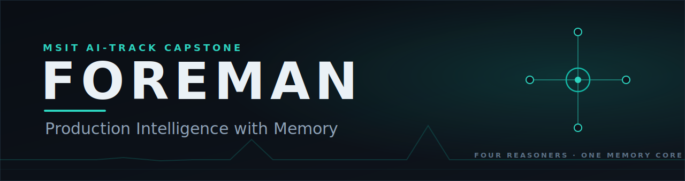
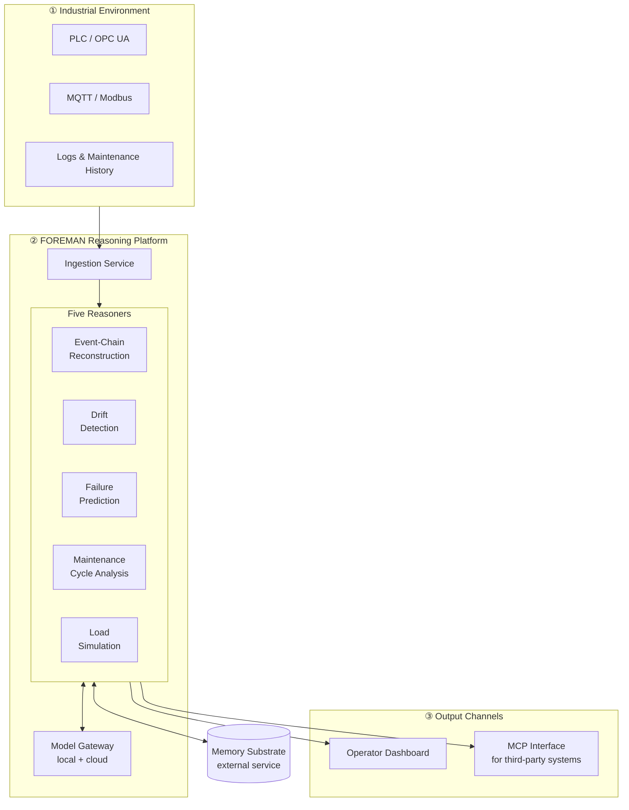

<div align="center">

<a href="https://patricznr1.github.io/foreman/"></a>

**[▶ Live project page with the embedded deck →](https://patricznr1.github.io/foreman/)**

*An AI platform that doesn't just monitor industrial production environments — it remembers them.*

[](https://github.com/patricznr1/foreman/actions/workflows/ci.yml)


</div>

---

## What it is

Production lines generate data non-stop — sensor readings, PLC states, maintenance records, operator notes. Classic monitoring systems show the **current** state and raise an alarm when a threshold is crossed. What they lack is **memory**. They don't know that the same bearing temperature preceded a failure three weeks ago, or that a slow drift has been building for days.

**FOREMAN** closes that gap. It lays a reasoning layer with long-term memory over the production environment and answers questions that snapshots can't:

- *Which chain of events led to this failure?*
- *Is a process slowly drifting out of its normal range?*
- *When is this component likely to fail?*
- *Can the plant handle this planned extra load?*

The name says it all: a *foreman* is the experienced supervisor who has known the shop floor for years — and that institutional experience is exactly what FOREMAN provides as a system.

> **Context:** FOREMAN is the capstone project of the MSIT AI track. It combines 17 years of industrial background (workshop management, field service, PLC programming) with applied AI architecture.

---

## Architecture

Three cleanly decoupled layers. Industry delivers the data, FOREMAN reasons, operators act.



### The five reasoners

| Reasoner | The question it answers | Method (high level) |
|---|---|---|
| **Event-Chain Reconstruction** | What led to this state? | Time-filtered recall + LLM synthesis |
| **Drift Detection** | Is something drifting slowly? | Statistical deviation monitoring |
| **Failure Prediction** | When will it fail? | Gradient boosting + LLM explanation |
| **Maintenance-Cycle Analysis** | Which maintenance actually helps? | Causal evaluation of past interventions |
| **Load Simulation** | Can the plant take this load? | Numerical simulation + Monte Carlo |

### The memory substrate

FOREMAN builds on an **external, biologically inspired memory substrate** that it consumes like a database. The substrate manages semantic events over time, consolidates recurring patterns, and monitors stability automatically. For FOREMAN it is a black-box dependency behind an HTTP API — the substrate code is **not** part of this repository.

---

## Tech stack

| Layer | Technology |
|---|---|
| **Backend** | Python 3.12, FastAPI, async SQLAlchemy 2.0, Pydantic v2 |
| **Storage** | PostgreSQL + TimescaleDB (time series) + vector search |
| **Model gateway** | LiteLLM — local model (Qwen3 via Ollama) + cloud fallback (Anthropic) |
| **Frontend** | Next.js 15, Tailwind CSS, shadcn/ui, Recharts |
| **Industrial connectivity** | asyncua (OPC UA), paho-mqtt, pymodbus |
| **Integration** | Model Context Protocol (MCP) SDK |
| **Operations** | Docker Compose |

---

## Project structure

```
foreman/
├── README.md            ← you are here
├── GROUND_TRUTH.md      ← the specification (single source of truth)
├── pyproject.toml       ← deps + strict typing/lint/test config
├── docker-compose.yml   ← TimescaleDB + app
├── Dockerfile           ← runtime image (incl. NER model)
├── postgres.conf        ← TimescaleDB tuning
├── alembic.ini
├── src/foreman/         ← application package (config · db · core · api · substrate)
├── migrations/          ← Alembic migrations (schema + TimescaleDB setup)
├── tests/               ← unit + integration tests
├── docs/
│   ├── WALKTHROUGH.md   ← plain-language explanation of every building block (German)
│   ├── research/        ← binding implementation references
│   └── compliance/      ← EU AI Act + GDPR assessments
├── .env.example         ← configuration contract (no secrets)
└── .gitignore           ← protects secrets & the memory connection
```

> Code is added module by module. See **[GROUND_TRUTH.md](GROUND_TRUTH.md)** for the binding state and **[docs/WALKTHROUGH.md](docs/WALKTHROUGH.md)** for the plain-language explanation.

---

## Documentation principle

This project deliberately maintains **two** documents in parallel:

- **`GROUND_TRUTH.md`** — *the truth.* What holds: schema, routes, stack, conventions. Machine-near and concise.
- **`docs/WALKTHROUGH.md`** — *the explanation.* Why and how, in plain language. Per building block: what it does and where it sits in the architecture. *(Written in German.)*

Both are updated **in the same commit as the code** — so they cannot drift from reality.

---

## Engineering standards

This platform is built to rigorous, reviewable standards — not vibe-coded.
Every change passes defined gates before it reaches `main`:

- **Type safety** — `mypy --strict` / `tsc --noEmit`, zero errors
- **Lint & complexity** — `ruff` / `eslint`, clean; cyclomatic-complexity gate
- **Tests** — `pytest`, ≥ 85 % coverage, a mandatory test block per feature
- **Security** — OWASP Web & LLM Top 10 (2025), secrets scan, dependency audit
- **Privacy by design** — GDPR Art. 25: worker data pseudonymized at the adapter layer (HMAC tokens; free-text names NER-masked)
- **EU AI Act** — risk classification documented before code is written (Phase 0)
- **Observability** — structured per-reasoner logs + Prometheus metrics (OWASP A09)
- **Human-in-the-loop** — safety-critical recommendations require operator acknowledgment (BSI)
- **Bounded consumption** — rate-limiting + pinned model versions (LLM10 / LLM03)
- **Living docs** — GROUND_TRUTH + WALKTHROUGH updated in the same commit, so
  documentation cannot drift from the code

See [`GROUND_TRUTH.md`](GROUND_TRUTH.md) §10 for the binding definition.

---

## Testing

Every push and pull request runs the full quality gate in CI (see the **CI badge** at the top) — `mypy --strict`, `ruff check`, `ruff format --check`, and `pytest` **against a real TimescaleDB/pgvector service**, not mocks. The suite is layered:

| Layer | What it exercises | How |
|---|---|---|
| **Unit** | pure logic — schema validation, drift math, grounding/output-guard, embedding L2-norm/dim-check/fallback | in-memory, no I/O |
| **Integration** | the real write/read paths against **TimescaleDB + pgvector** (HNSW similarity, ingestion, reasoner pipeline) | `@pytest.mark.integration`, real DB |
| **Red-team** | prompt-injection payloads driven through the **live LLM-reasoner pipeline** — spotlighting holds, output-guard flags invented sources/numbers, reasoner stays inert | `tests/reasoners/event_chain/security/` |
| **Smoke** | real round-trips against local Ollama (LLM completion + `bge-m3` embeddings) | `@pytest.mark.smoke`, skips cleanly if absent |

**Current state (`main`, F2–F6):** ~370 tests green, **≈ 95 % branch coverage**, `mypy --strict` 0 errors across the package, `ruff` clean. The coverage gate **fails the build under 85 %** — enforced in `pyproject.toml`, not just claimed. Each feature ships a mandatory test block (happy path · error · auth · edge), and docs (`GROUND_TRUTH` + `WALKTHROUGH`) move in the same commit as the code.

```bash
uv run mypy && uv run ruff check && uv run ruff format --check && uv run pytest   # the same gate CI runs
```

---

## Local development

Requirements: Python 3.12, [uv](https://docs.astral.sh/uv/), Docker.

```bash
# 1. Dependencies (isolated environment)
uv venv --python 3.12
uv pip install -e ".[dev]"

# 2. NER model for worker-note redaction (~560 MB)
uv run python -m spacy download de_core_news_lg

# 3. Configuration — copy and fill in (never commit real secrets)
cp .env.example .env

# 4. Database + app
docker compose up -d timescaledb
uv run alembic upgrade head            # schema + TimescaleDB setup
uv run uvicorn foreman.main:app --reload

# 5. Quality gates
uv run mypy && uv run ruff check && uv run ruff format --check && uv run pytest
```

Integration tests run against a real TimescaleDB (`timescale/timescaledb-ha:pg16`). Point `FOREMAN_TEST_DATABASE_URL` at a test database; without a reachable database the integration tests skip automatically.

---

## Status

🚧 **Active development.** In `main`: the foundation (F2 — schema, TimescaleDB migrations, JWT auth, CRUD + batch ingestion, pseudonymization + NER), data adapters with a synthetic simulation (F3), the **drift reasoner** (F4 — ADWIN over `river`), the **model gateway** (F-LLM — own `LLMGateway` abstraction over LiteLLM, local-first), and the **event-chain reasoner** (F6 — the first LLM free-text reasoner, with a sharp prompt-injection red-team). In review: **semantic note search** (F-SEM — embeddings + HNSW vector search). Next: operator dashboard or failure prediction. Roadmap and binding state live in the [GROUND_TRUTH](GROUND_TRUTH.md).

---

## Author

**Patric Zeller** — AI architect · [patric-zeller.de](https://patric-zeller.de) · [GitHub](https://github.com/patricznr1) · [LinkedIn](https://www.linkedin.com/in/patric-zeller-71781b17b)

---

<div align="center">
<sub>© 2026 Patric Zeller · All Rights Reserved · Showcase and educational repository, not licensed for reuse.</sub>
</div>
