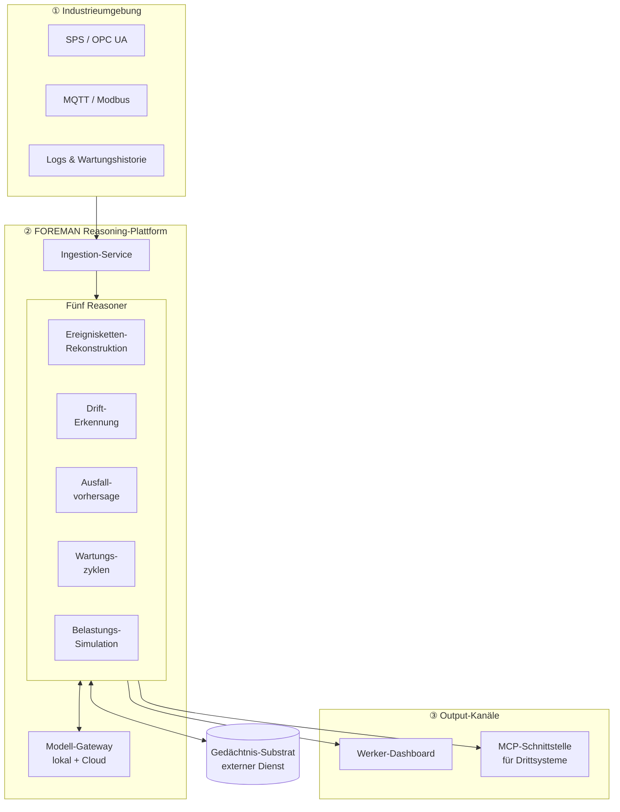

<div align="center">

# FOREMAN

### Production Intelligence with Memory

*Eine KI-Plattform, die industrielle Produktionsumgebungen nicht nur überwacht, sondern sich an sie erinnert.*


</div>

---

## Worum es geht

Produktionsanlagen erzeugen pausenlos Daten — Sensorwerte, SPS-Zustände, Wartungseinträge, Werkernotizen. Klassische Monitoring-Systeme zeigen den **aktuellen** Zustand und schlagen bei Schwellwerten Alarm. Was ihnen fehlt: **Gedächtnis**. Sie wissen nicht, dass dieselbe Lagertemperatur vor drei Wochen einem Ausfall vorausging, oder dass eine schleichende Drift seit Tagen läuft.

**FOREMAN** schließt diese Lücke. Die Plattform legt über die Produktionsumgebung eine Reasoning-Schicht mit Langzeitgedächtnis und beantwortet Fragen, die Momentaufnahmen nicht beantworten können:

- *Welche Ereigniskette führte zu diesem Ausfall?*
- *Verschiebt sich ein Prozess langsam aus dem Normalbereich?*
- *Wann fällt diese Komponente voraussichtlich aus?*
- *Hält die Anlage diese geplante Mehrlast aus?*

Der Name ist Programm: Ein *Foreman* (Werkmeister) ist der erfahrene Vorarbeiter, der die Halle über Jahre kennt — und genau diese institutionelle Erfahrung gibt FOREMAN als System ab.

> **Kontext:** FOREMAN ist das Capstone-Projekt des MSIT AI-Tracks. Es verbindet 17 Jahre Industriehintergrund (Werkstattleitung, Servicetechnik, SPS-Programmierung) mit angewandter KI-Architektur.

---

## Architektur

Drei sauber entkoppelte Schichten. Die Industrie liefert Daten, FOREMAN denkt, die Werker handeln.



### Die fünf Reasoner

| Reasoner | Frage, die er beantwortet | Methodik (grob) |
|---|---|---|
| **Ereignisketten-Rekonstruktion** | Was führte zu diesem Zustand? | Zeitlich gefilterter Recall + LLM-Synthese |
| **Drift-Erkennung** | Verschiebt sich etwas schleichend? | Statistische Abweichungs-Überwachung |
| **Ausfallvorhersage** | Wann fällt das aus? | Gradient Boosting + LLM-Erklärung |
| **Wartungszyklen-Analyse** | Welche Wartung wirkt wirklich? | Kausale Bewertung historischer Eingriffe |
| **Belastungs-Simulation** | Hält die Anlage diese Last? | Numerische Simulation + Monte-Carlo |

### Das Gedächtnis-Substrat

FOREMAN setzt auf ein **externes, biologisch inspiriertes Gedächtnis-Substrat**, das wie eine Datenbank konsumiert wird. Es verwaltet semantische Ereignisse über die Zeit, konsolidiert wiederkehrende Muster und überwacht Stabilität automatisch. Für FOREMAN ist es eine Black-Box-Abhängigkeit hinter einer HTTP-API — der Substrat-Code ist **nicht** Teil dieses Repositories.

---

## Tech-Stack

| Schicht | Technologie |
|---|---|
| **Backend** | Python 3.12, FastAPI, async SQLAlchemy 2.0, Pydantic v2 |
| **Datenhaltung** | PostgreSQL + TimescaleDB (Zeitreihen) + Vektor-Suche |
| **Modell-Gateway** | LiteLLM — lokales Modell (Qwen3 via Ollama) + Cloud-Fallback (Anthropic) |
| **Frontend** | Next.js 15, Tailwind CSS, shadcn/ui, Recharts |
| **Industrie-Anbindung** | asyncua (OPC UA), paho-mqtt, pymodbus |
| **Integration** | Model Context Protocol (MCP) SDK |
| **Betrieb** | Docker Compose |

---

## Projektstruktur

```
foreman/
├── README.md            ← du bist hier
├── GROUND_TRUTH.md      ← die Spezifikation (Single Source of Truth)
├── docs/
│   └── WALKTHROUGH.md   ← Klartext-Erklärung jedes Bausteins (Deutsch)
├── .env.example         ← Konfigurations-Vertrag (ohne Secrets)
└── .gitignore           ← schützt Secrets & Gedächtnis-Anbindung
```

> Der Code wird modulweise ergänzt. Siehe **[GROUND_TRUTH.md](GROUND_TRUTH.md)** für den verbindlichen Stand und **[docs/WALKTHROUGH.md](docs/WALKTHROUGH.md)** für die Erklärung in Klartext.

---

## Dokumentations-Prinzip

Dieses Projekt führt **zwei** Dokumente parallel, und das mit Absicht:

- **`GROUND_TRUTH.md`** — *die Wahrheit.* Was gilt: Schema, Routen, Stack, Konventionen. Maschinennah und knapp.
- **`docs/WALKTHROUGH.md`** — *die Erklärung.* Warum und wie, in verständlichem Deutsch. Pro Baustein: Was tut er, wo sitzt er in der Architektur, und welche Frage könnte ein Prüfer dazu stellen.

Beide werden **im selben Commit wie der Code** aktualisiert — sie können also nicht von der Realität abdriften.

---

## Status

🚧 **Aktive Entwicklung.** Fundament-Phase: Skeleton, Datenanbindung, erster End-to-End-Reasoner (Drift). Roadmap und Detailstand in der GROUND_TRUTH.

---

## Autor

**Patric Zeller** — KI-Architekt · [patric-zeller.de](https://patric-zeller.de) · [GitHub](https://github.com/patricznr1)

---

<div align="center">
<sub>© 2026 Patric Zeller · All Rights Reserved · Showcase- und Lehr-Repository, keine Lizenz zur Wiederverwendung.</sub>
</div>
