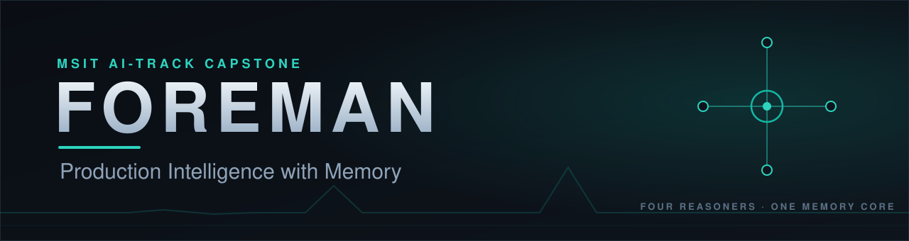
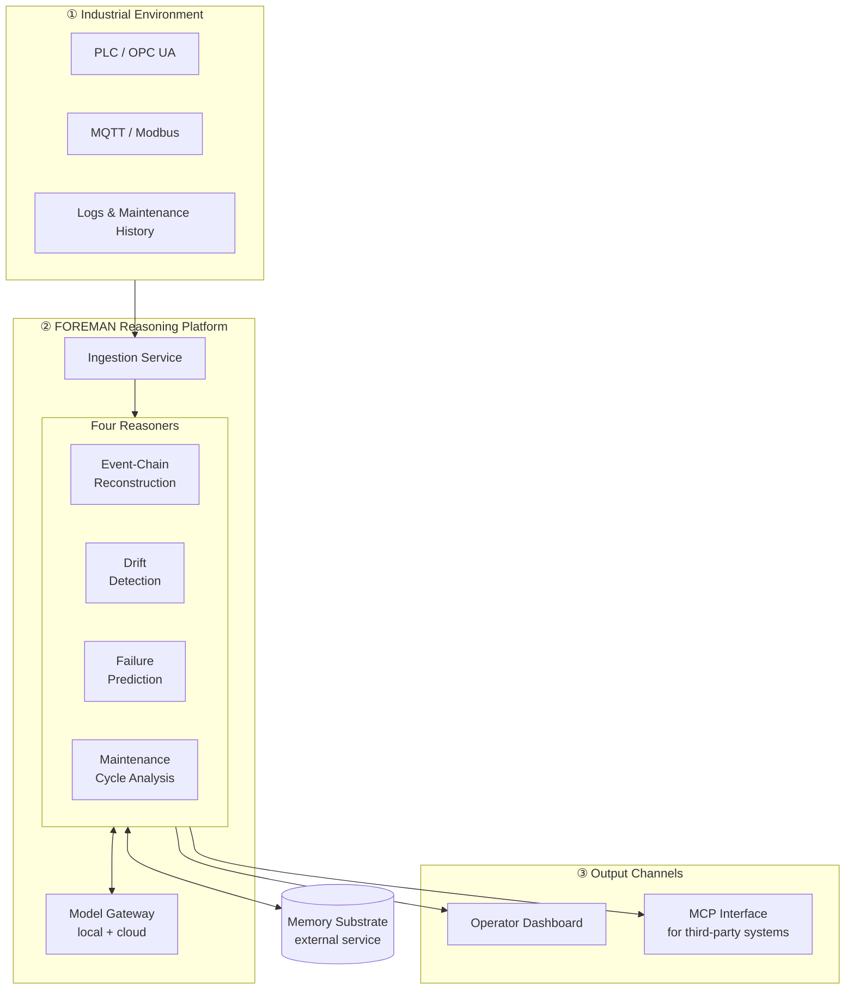

<div align="center">

<a href="https://patricznr1.github.io/foreman/"></a>

**[▶ Live project page with the embedded deck →](https://patricznr1.github.io/foreman/)**

*An AI platform that doesn't just monitor industrial production environments — it remembers them.*

[](https://github.com/patricznr1/foreman/actions/workflows/ci.yml)


[](https://www.repostatus.org/#wip)
[](SECURITY.md)


[](LICENSE)

</div>

---

## What it is

Production lines generate data non-stop — sensor readings, PLC states, maintenance records, operator notes. Classic monitoring systems show the **current** state and raise an alarm when a threshold is crossed. What they lack is **memory**. They don't know that the same bearing temperature preceded a failure three weeks ago, or that a slow drift has been building for days.

**FOREMAN** closes that gap. It lays a reasoning layer with long-term memory over the production environment and answers questions that snapshots can't:

- *Which chain of events led to this failure?*
- *Is a process slowly drifting out of its normal range?*
- *When is this component likely to fail?*
- *What load has this machine actually carried — and where were its limits?*

The name says it all: a *foreman* is the experienced supervisor who has known the shop floor for years — and that institutional experience is exactly what FOREMAN provides as a system.

> **Context:** FOREMAN is the capstone project of the MSIT AI track. It combines 17 years of industrial background (workshop management, field service, PLC programming) with applied AI architecture.

---

## Try it live

A public demo instance is available — no registration, no request. The credentials below are
deliberately shared so anyone can look around.

| | |
| --- | --- |
| **URL** | **[frontend-production-169a.up.railway.app](https://frontend-production-169a.up.railway.app)** |
| **E-mail** | `chef@foreman.de` |
| **Password** | `ForemanDemo2026!` |

The login is the *plant manager* profile: it sees the whole fleet, writes shift notes, triggers
the reasoners and acknowledges alarms — every capability is reachable from this one account, with
no role switching.

**Where to start:** the fleet cockpit gives you the overall picture; a machine card shows live
sensor values with an honest status per data point; the archive searches notes, maintenance
records, alarms and the memory together, and marks a result that two of them found
independently. The reasoners are on demand — reconstructing an event chain or
requesting a recommendation is a deliberate click, never automatic.

**A few honest notes before you click:**

- **The interface is German.** FOREMAN speaks the language of the shop floor it was designed for.
- **The data is simulated.** No real plant is connected. Every prediction carries a visible
  simulation caveat — that is a deliberate design rule, not a placeholder.
- **It is a shared instance.** Anything you enter is visible to everyone else trying the demo,
  and it stays in the database. **Please do not enter real personal data.** Worker notes are
  run through name redaction before they are stored, but that is a safety net, not a guarantee.
- **AI analyses are rate-limited.** The reasoners call a language model, and the demo runs on a
  capped budget. If an analysis is temporarily unavailable, the rest of the system keeps working
  — alarms, trends and the archive are unaffected.
- **Nothing here switches anything.** FOREMAN explains, it does not actuate. There is no path
  from this interface to a machine.

---

## Architecture

Three cleanly decoupled layers. Industry delivers the data, FOREMAN reasons, operators act.


```mermaid
flowchart TB
    subgraph L1["① Industrial Environment"]
        direction LR
        SPS[PLC / OPC UA] 
        MQTT[MQTT / Modbus]
        LOGS[Logs & Maintenance History]
    end

    subgraph L2["② FOREMAN Reasoning Platform"]
        direction TB
        ING[Ingestion Service]
        subgraph R["Four Reasoners"]
            direction LR
            R1[Event-Chain\nReconstruction]
            R2[Drift\nDetection]
            R3[Failure\nPrediction]
            R4[Maintenance\nCycle Analysis]
        end
        GW[Model Gateway\nlocal + cloud]
    end

    subgraph L3["③ Output Channels"]
        direction LR
        DASH[Operator Dashboard]
        MCP[MCP Interface\nfor third-party systems]
    end

    MEM[(Memory Substrate\nexternal service)]

    L1 --> ING --> R
    R <--> GW
    R <--> MEM
    R --> DASH
    R --> MCP
```

### The four reasoners

| Reasoner | The question it answers | Method (high level) |
|---|---|---|
| **Event-Chain Reconstruction** | What led to this state? | Time-filtered recall + LLM synthesis |
| **Drift Detection** | Is something drifting slowly? | Statistical deviation monitoring |
| **Failure Prediction** | When will it fail? | Gradient boosting + LLM explanation |
| **Maintenance-Cycle Analysis** | Which maintenance actually helps? | Causal evaluation of past interventions |

> **Load data, not load simulation.** FOREMAN does not run its own load simulation — a real one needs parameters outside FOREMAN's observation boundary (machine timing, tool/material behaviour, environment) that the platform never sees. Instead it exposes the *observed* load profiles and limits read-only over the MCP interface, for an external simulation tool to build on. See [GROUND_TRUTH.md](GROUND_TRUTH.md) §2 / §17.

### The memory substrate

FOREMAN builds on an **external, biologically inspired memory substrate** that it consumes like a database. The substrate manages semantic events over time, consolidates recurring patterns, and monitors stability automatically. For FOREMAN it is a black-box dependency behind an HTTP API — the substrate code is **not** part of this repository.

---

## Tech stack

| Layer | Technology |
|---|---|
| **Backend** | Python 3.12, FastAPI, async SQLAlchemy 2.0, Pydantic v2 |
| **Storage** | PostgreSQL + TimescaleDB (time series) + vector search |
| **Model gateway** | LiteLLM — local model (Qwen3 via Ollama) + cloud fallback (Anthropic) |
| **Frontend** | Next.js 15 (App Router), React 19, Tailwind CSS 4, bespoke SVG (no charting library) |
| **Industrial connectivity** | asyncua (OPC UA), paho-mqtt, pymodbus — *target picture, not yet installed*; the only adapter built so far is the simulation one ([GROUND_TRUTH.md](GROUND_TRUTH.md) §3) |
| **Integration** | Model Context Protocol (MCP) SDK |
| **Operations** | Docker Compose |

---

## Project structure

```
foreman/
├── README.md            ← you are here
├── GROUND_TRUTH.md      ← the specification (single source of truth)
├── pyproject.toml       ← deps + strict typing/lint/test config
├── docker-compose.yml   ← TimescaleDB + app
├── Dockerfile           ← runtime image (incl. NER model)
├── postgres.conf        ← TimescaleDB tuning
├── alembic.ini
├── src/foreman/         ← application package (config · db · core · api · substrate)
├── migrations/          ← Alembic migrations (schema + TimescaleDB setup)
├── tests/               ← unit + integration tests
├── docs/
│   ├── WALKTHROUGH.md   ← plain-language explanation of every building block (German)
│   ├── research/        ← binding implementation references
│   └── compliance/      ← EU AI Act + GDPR assessments
├── .env.example         ← configuration contract (no secrets)
└── .gitignore           ← protects secrets & the memory connection
```

> Code is added module by module. See **[GROUND_TRUTH.md](GROUND_TRUTH.md)** for the binding state and **[docs/WALKTHROUGH.md](docs/WALKTHROUGH.md)** for the plain-language explanation.

---

## Documentation principle

This project deliberately maintains **two** documents in parallel:

- **`GROUND_TRUTH.md`** — *the truth.* What holds: schema, routes, stack, conventions. Machine-near and concise.
- **`docs/WALKTHROUGH.md`** — *the explanation.* Why and how, in plain language. Per building block: what it does and where it sits in the architecture. *(Written in German.)*

Both are updated **in the same commit as the code**. That reduces drift; it does not
abolish it. Where documentation and code disagree, the documentation is the defect — and
it is worth reporting. Two such drifts were found and closed on 2026-08-26, recorded as
F-007 and F-008 in [`security/findings.yaml`](security/findings.yaml).

---

## Engineering standards

This platform is built to rigorous, reviewable standards — not vibe-coded.
Every change passes defined gates before it reaches `main`:

- **Type safety** — `mypy --strict` / `tsc --noEmit`, zero errors
- **Lint & complexity** — `ruff` / `eslint`, clean; cyclomatic complexity capped at 12 in
  application code (`ruff` C90; the check scripts are exempt, with the reason in `pyproject.toml`)
- **Tests** — `pytest`, ≥ 85 % coverage, a mandatory test block per feature
- **Security** — OWASP Web & LLM Top 10 (2025); `gitleaks` over the full history and `pip-audit` / `npm audit` run as gates in CI, with Dependabot security alerts as a second source
- **Privacy by design** — GDPR Art. 25: worker data pseudonymized at the adapter layer (HMAC tokens; free-text names NER-masked)
- **EU AI Act** — risk classification documented before code is written (Phase 0)
- **Observability** — structured per-reasoner logs + Prometheus metrics (OWASP A09)
- **Human-in-the-loop** — safety-critical recommendations require operator acknowledgment (BSI)
- **Bounded consumption** — rate-limiting + pinned model versions (LLM10 / LLM03)
- **Living docs** — GROUND_TRUTH + WALKTHROUGH updated in the same commit; where they
  disagree with the code, the documentation is the defect and gets reported as one

See [`GROUND_TRUTH.md`](GROUND_TRUTH.md) §10 for the binding definition.

---

## Testing

Every push and pull request runs three CI jobs (see the **CI badge** at the top). The
backend job is `mypy --strict`, `ruff check`, `ruff format --check` and `pytest`
**against a real TimescaleDB/pgvector service**, not mocks, followed by the two register
checks and `pip-audit`. Alongside it, `gitleaks` scans the full history in its own job,
and the frontend job runs token sync, `tsc --noEmit`, `eslint`, `vitest`, `npm audit` and
a production build. The backend suite is layered:

| Layer | What it exercises | How |
|---|---|---|
| **Unit** | pure logic — schema validation, drift math, grounding/output-guard, embedding L2-norm/dim-check/fallback | in-memory, no I/O |
| **Integration** | the real write/read paths against **TimescaleDB + pgvector** (HNSW similarity, ingestion, reasoner pipeline) | `@pytest.mark.integration`, real DB |
| **Red-team** | prompt-injection payloads driven through the **live LLM-reasoner pipeline** — spotlighting holds, output-guard flags invented sources/numbers, reasoner stays inert | `tests/reasoners/event_chain/security/` |
| **Smoke** | real round-trips against local Ollama (LLM completion + `bge-m3` embeddings) | `@pytest.mark.smoke`, skips cleanly if absent |

**Current state (`main`, measured 2026-08-22 in CI):** **1068 backend tests** green (2 skipped — they need a local model — and 4 opt-in tests deselected: NER, and the release checks that run against a live counterpart), plus **744 frontend tests** across 146 files. **94.28 % branch coverage** against a real TimescaleDB. `mypy --strict` 0 errors across 150 source files, `ruff` check and format clean, `tsc --noEmit` and `eslint` clean. The coverage gate **fails the build under 85 %** — enforced in `pyproject.toml`, not just claimed. Each feature ships a mandatory test block (happy path · error · auth · edge), and docs (`GROUND_TRUTH` + `WALKTHROUGH`) move in the same commit as the code.

Numbers in this README are entries in the [claims register](CLAIMS.md) — each one carries its measurement conditions, its evidence status, and the date it was taken. A measurement without a register entry counts as not having happened (see `GROUND_TRUTH.md` §23).

```bash
uv run mypy && uv run ruff check && uv run ruff format --check && uv run pytest   # the same gate CI runs
```

---

## Local development

Requirements: Python 3.12, [uv](https://docs.astral.sh/uv/), Docker.

```bash
# 1. Dependencies (isolated environment)
uv venv --python 3.12
uv pip install -e ".[dev]"

# 2. NER model for worker-note redaction (~560 MB)
uv run python -m spacy download de_core_news_lg

# 3. Configuration — copy and fill in (never commit real secrets)
cp .env.example .env

# 4. Database + app
docker compose up -d timescaledb
uv run alembic upgrade head            # schema + TimescaleDB setup
uv run uvicorn foreman.main:app --reload

# 5. Quality gates
uv run mypy && uv run ruff check && uv run ruff format --check && uv run pytest
```

Integration tests run against a real TimescaleDB (`timescale/timescaledb-ha:pg16`). Point `FOREMAN_TEST_DATABASE_URL` at a test database; without a reachable database the integration tests skip automatically.

---

## Status

🚧 **Active development.** In `main`: the foundation (F2 — schema, TimescaleDB migrations, JWT auth, CRUD + batch ingestion, pseudonymization + NER), data adapters with a synthetic simulation (F3), the **drift reasoner** (F4 — ADWIN over `river`), the **model gateway** (F-LLM — own `LLMGateway` abstraction over LiteLLM, local-first), the **event-chain reasoner** (F6 — the first LLM free-text reasoner, with a sharp prompt-injection red-team), **semantic note search** (F-SEM — embeddings + HNSW), the **failure-prediction reasoner** (F-PRED — an honestly declared method demonstrator on simulation data, see its [model card](docs/models/failure_prediction_model_card.md)) with its **LLM explanation layer** (F-REC), the read-only **MCP interface** (F7), and the **operator dashboard** (F5 — eight of ten sections built, plus the platform/audit view).

Three of the four reasoners are built. Still open: **maintenance-cycle analysis** (reasoner #4 — data-dependent, it needs a real maintenance history) and the two remaining dashboard sections. Roadmap and binding state live in the [GROUND_TRUTH](GROUND_TRUTH.md); what may be *claimed* about any of it lives in [CLAIMS.md](CLAIMS.md).

---

---

## Reviewing this repository

FOREMAN is published so it can be looked at, and it is built in the open while it is
still being built. Two things follow from that, and both are written down rather than
left to be inferred.

**The public demo and the target deployment are different on purpose.** The demo is
internet-reachable, runs on synthetic data and hands out its credentials in this README.
The platform is designed for an on-premises plant network with real data and per-user
accounts. Several controls sit at the network boundary in the second picture and are
genuinely absent in the first. Which one a finding refers to changes what it means.

**A repository shows the application layer.** Configuration values, TLS, network
segmentation, secrets storage and the external memory service are not in it —
`.env.example` lists which variables exist, not what they are set to.

- [`SECURITY.md`](SECURITY.md) — threat model, trust boundaries, the two deployment
  profiles, and what does and does not count as a vulnerability here
- [`security/findings.yaml`](security/findings.yaml) — twenty-three findings a review is likely
  to surface, each with the observation, whether it is correct, the deployment assumption
  behind any acceptance, and its status. Six are accepted risks with that condition
  recorded, three are open work, thirteen are already closed, one is a documented false
  positive. Verified in CI by `scripts/check_findings.py`, including these counts.
- [`REVIEW.md`](REVIEW.md) · [`AGENTS.md`](AGENTS.md) — the same context for automated
  reviewers and coding agents
- [`SECURITY-INSIGHTS.yml`](SECURITY-INSIGHTS.yml) — machine-readable posture
  ([OpenSSF Security Insights](https://security-insights.openssf.org/))

None of these ask a reviewer to omit anything. They exist so that the step between a
finding and a verdict is written down instead of improvised — and a finding that
contradicts what they claim is the most useful report this project can receive.

## Author

**Patric Zeller** — AI architect · [patric-zeller.de](https://patric-zeller.de) · [GitHub](https://github.com/patricznr1) · [LinkedIn](https://www.linkedin.com/in/patric-zeller-71781b17b)

---

## License

© 2026 Patric Zeller. **All rights reserved.** This repository is published publicly as a showcase for evaluation only and is **not licensed for reuse**. See [`LICENSE`](LICENSE) for the full terms.

---

<div align="center">
<sub>© 2026 Patric Zeller · All Rights Reserved · Showcase and educational repository, not licensed for reuse.</sub>
</div>
